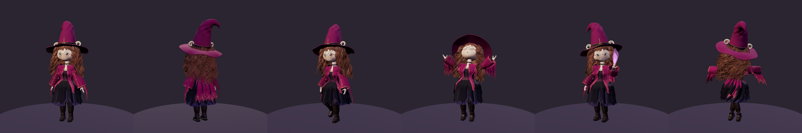
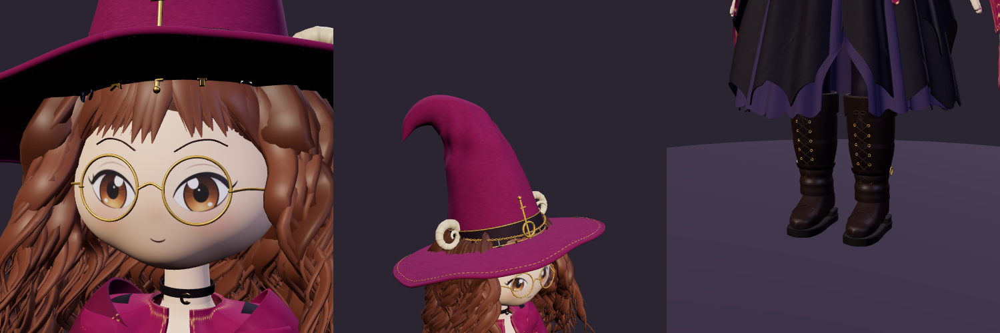

# The Moonlight Witch, HD



A much more detailed 3D model of the Moonlight Witch, rigged and animated, in one file: **`witch-hd.glb`**.
She is sized and oriented for Wickhollow Square, and `square.html` shows her walking around it.

| | |
|---|---|
| File | `witch-hd.glb` (glTF 2.0 binary), 23.8 MB |
| Triangles | 756,262 (449,169 vertices) |
| Skeleton | 137 bones: body, fingers, hair, skirt, shawl, sleeve drapes, hat, charms, athame, witchfire |
| Animations | 13 (below) |
| Face shapes | Blink, Smile, Surprise, Pain (morph targets) |
| Materials | 35 PBR materials, 7 painted textures |
| Size and facing | 1.59 m to the hat tip, feet at y = 0, facing +z (the game's scale) |
| Checked | Khronos glTF Validator: 0 errors, 0 warnings |



## What's on her

Everything the art shows, modeled rather than painted flat:

- **Face**: a soft, round sculpted head; painted eyes, lashes and mouths as decals that change with her face
  shapes; brows; round gold wire glasses with arms that run back to her ears; crescent earrings.
- **Hair**: about 200 wavy locks in three layers, each a clump with two finer strands beside it, draped over her
  shoulders and shawl; pointed bangs; locks framing her face. It swings on 26 bones.
- **Hat**: a plum felt crown that crumples and flops back; a wide wavy brim with a rolled, gold-stitched edge;
  a gold-piped band; cream ram horns with ridges; the key-shaped sigil; a chain of real links with crosses, stars
  and crescents hanging from it.
- **Shawl**: magenta wool with gold-stitched moons and stars; a collar, front panels and a long tattered back;
  wide bell sleeves whose pointed drapes hang from their own bones, so they fall like wings when she lifts her
  arms.
- **Dress**: a fitted bodice laced up the front with gold eyelets and a bow; a lace frill at the neckline;
  a skirt in soft folds with tattered points and a slit; a shorter back layer; a scalloped lilac underskirt;
  a plum sash with a crescent buckle and tails; a leather pouch.
- **Jewelry**: a velvet choker with a crescent, a key pendant on a fine chain, amethyst bead bracelets and
  gold bangles.
- **Hands**: five jointed fingers each, with plum nails.
- **Boots**: laced up the front with eyelets and a bow, a folded cuff, an ankle strap with a gold buckle, a
  stacked heel and a welted sole.
- **Athame**: a silver blade, a gold guard and crescent pommel with a moonstone, a wrapped grip and a charm
  on a chain. It sits in a leather sheath on her right hip and is drawn into her hand for Gather and Athame Dash.
- **Witchfire**: a three-layer violet flame that burns upright in her left hand while she casts.

## Animations

| Clip | Length | Notes |
|---|---|---|
| `Idle` | 6.0 s, loops | breathing, a weight shift, looking about, two blinks |
| `Walk` | 0.84 s, loops | heel-toe steps with planted feet; covers 0.72 m/s |
| `Run` | 0.5 s, loops | a jog with a flight step; covers 1.65 m/s |
| `Gather` | 2.6 s | kneels, draws the athame, cuts a stem, picks it, admires it, stands, sheathes |
| `CastWitchfire` | 1.8 s | lifts her left hand and witchfire blooms in it |
| `ThrowWitchfire` | 1.3 s | winds up and flings it |
| `Moonlight` | 2.4 s | arms rise open to the sky, onto her toes |
| `Cheer` | 1.4 s | two happy hops, fist up |
| `Wave` | 2.0 s | a friendly wave |
| `AthameDash` | 1.4 s | draws, lunges with a sweeping cut, hops back |
| `Curtsy` | 2.2 s | a witchy greeting |
| `Hurt` | 0.8 s | a flinch |
| `Twirl` | 1.6 s | one spin, skirt, shawl and hair flaring |

The loops play in place. To keep her feet from sliding, play `Walk` or `Run` at `timeScale = speed / 0.72` or
`speed / 1.65`. Every clip also animates the hair, skirt, shawl, sleeve drapes, hat tip and charms: that motion
was simulated with spring physics when the file was built, so nothing needs simulating at run time. Every clip
has a track for every moving bone and for the face, so crossfading between any two is clean.

The one-shots start and end in her standing pose, so they blend in and out of `Idle`. The `witchfire` bone
rests at scale 0.001 (hidden), and the casting clips scale it up.

## Using her in three.js

```js
import * as THREE from 'three';
import { GLTFLoader } from 'three/addons/loaders/GLTFLoader.js';

const gltf = await new GLTFLoader().loadAsync('witch-hd/witch-hd.glb');
const witch = gltf.scene;
witch.traverse((o) => { if (o.isMesh) o.frustumCulled = false; });
scene.add(witch);

const mixer = new THREE.AnimationMixer(witch);
const clip = (name) => mixer.clipAction(THREE.AnimationClip.findByName(gltf.animations, name));
clip('Walk').play();
// each frame: mixer.update(dt)
```

In the game, `demo/witch-hd-actor.js` wraps the model with the same interface as `src/actors/witch.js`
(`update(dt, speed, turn)`, `play(move, onHit)`, `busy`, `setMood(mood)`), with crossfades, speed-matched
walking, random blinks, a light for the witchfire, and an HD or toon look. The square's code drives her unchanged.

## The demos

- **`square.html`**: Wickhollow Square, the game's own scene and code, with the HD witch in place of the
  code-built one. Walk with the arrow keys, WASD or a click; hold Shift (or press Run) to run; keys 1-9 or the
  Moves panel play her animations; Zoom moves the camera in close. Hilde, Agnes, Inkblot and the herbs all work
  as in the game, and Gather plays when she picks an herb.
- **`viewer.html`**: her up close: orbit around her, play any clip, try her faces, and switch HD or toon.

Both load `witch-hd.glb` from the same folder. Browsers won't let a page opened from disk read that file, so
serve the folder, then open the page:

```
cd witch-hd
python3 -m http.server 8000     # then open http://localhost:8000/square.html
```

Opened from disk instead, the page asks you to choose the `.glb` file (or drop it on the page).

## How she's made

Everything is built in code, with no modeling program: shapes are sculpted from blended ellipsoids, swept tubes,
lofted surfaces and cloth panels with thickness. Every vertex gets skin weights and a vertex color. The
textures (eyes, mouths, the shawl's embroidery, felt, leather, fabric) are painted with canvas in headless
Chromium. The animations are pose functions with two-bone leg IK, and the physics is baked in.

| Folder | What it holds |
|---|---|
| `tools/build-model.mjs` | builds `witch-hd.glb` |
| `tools/model/` | the skeleton and each part: head, face, hair, hat, body, clothes, shawl, boots, props, jewelry |
| `tools/anim/` | poses and IK, the clips, the spring physics, the baker |
| `tools/lib/` | the geometry kit, the skinned-mesh builder, the glTF writer |
| `tools/textures/paint.js` | the texture painters |
| `tools/build-demo.mjs` | builds `square.html` and `viewer.html` |
| `tools/test-demo.mjs` | plays both pages in headless Chromium |
| `tools/shot.mjs` | renders the model from any angle, at any moment of any clip |
| `demo/` | the demo pages' code and the game adapter |

```
npm install                     # three.js and esbuild, in this folder
node tools/paint-textures.mjs   # paint the textures (needs Playwright's Chromium)
node tools/build-model.mjs      # build witch-hd.glb (under 10 seconds)
node tools/build-demo.mjs       # build square.html and viewer.html
node tools/test-demo.mjs        # try them in headless Chromium
node tools/shot.mjs out.png --views front,q,side,back --clip Walk --time 0.2
```

Nothing outside this folder was changed. The demos import the game's engine from `../src`, `../scenes` and
`../art` as it is.
